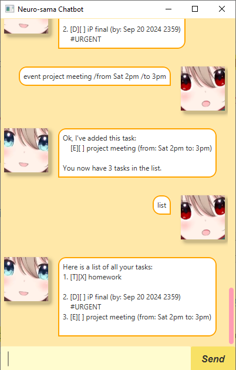

# Neuro-sama Chatbot User Guide



> "The 2020 Dodge Charger is a four door " — [Neuro-sama](https://www.youtube.com/@Neurosama)

Introducing Neuro! A CLI chatbot that provides a multitude of tools to ease your mind! It's
- text-based
- easy to learn
- ~~FAST~~ *SUPER* FAST to use :zap: :zap: :zap:

All you need to do is,
1. download it from [here](https://github.com/AgentHagu/ip/releases/tag/A-Jar)
2. run `java -jar neuro.jar` (as of now, double clicking does not work 😢)
3. add your tasks
4. let it manage your tasks for you (auto-save feature 🤯)

And it is **FREE**!

Features:
- [x] Add tasks (Todos, deadlines, events)
- [x] Attach dates to tasks
- [x] Mark (or unmark) tasks as done
- [ ] Managing deadlines (coming soon?)
- [ ] Reminders (~~coming soon~~ see my mood)

If you are a Java programmer, you can use it to practice Java too. Here's the `main` method:
```Java
public class Neuro {
    // Some other helper methods...

    public static void main(String[] args) {
        new Neuro("data/Neuro.txt").run();
    }
}
```

The character of "Neuro" in this project is inspired by the AI streamer [Neuro-sama](https://www.youtube.com/@Neurosama).

# Feature: Adding Tasks
Neuro allows users to add and save tasks. There are 3 different types of task available for users: Todos, Deadlines, Events.

## Adding Todos `todo`
Adds a Todo task to the task list.

Format: `todo TASK`

Examples: `todo Homework`

## Adding deadlines `deadline`
Adds a Deadline task to the task list. A Deadline task consists of a description and a deadline date/time.

Format: `deadline DESCRIPTION /by DEADLINE`

Example: `deadline Assignment 1 /by 30/07/2024 2359`

## Adding events `event`
Adds an Event task to the task list. An Event task consists of a description, a starting and an ending date/time.

Format: `event DESCRIPTION /from START /to END`

Example: `event Project meeting /from 2pm /to 3pm`

# Feature: Manage Tasks
Besides adding tasks, Neuro also provides commands to manage the tasks in the task list.

## List `list`
Shows a list of all tasks in the task list.

Format: `list`

## Find `find`
Shows a list of tasks in the task list that contain the search query.

Format: `find SEARCH_QUERY`

Example: `find book`

## Tag `tag`
Tags a list in the task list with the given tag(s).

Format: `tag INDEX TAG [MORE_TAGS]`

Example: `tag 1 Urgent`

## Delete `delete`
Deletes a task from the task list.

Format: `delete INDEX`

Example: `delete 2`

## Mark `mark`
Marks a task as 'done' in the task list.

Format: `mark INDEX`

Example: `mark 1`

## Mark `unmark`
Marks a task as 'undone' in the task list.

Format: `unmark INDEX`

Example: `unmark 1`

# Feature: Others
## Bye `bye`
Says bye to Neuro

Format: `bye`